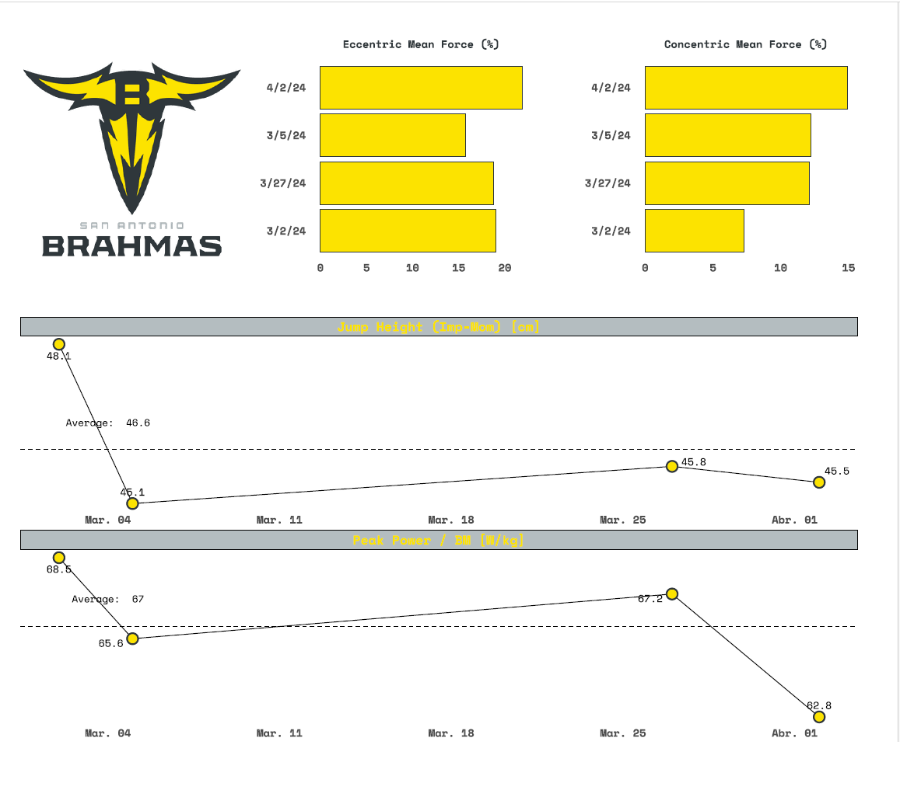
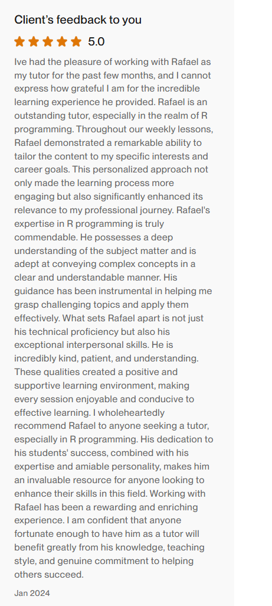

This year I created a course for a sports scientist that wanted to get into R. I taught the course in English via Zoom once a week, and I also developed a simple [course website](https://r4ds-sports.netlify.app/) to organize the materials.

The course is an introduction to R built around examples from sports science. It draws on the terrific [R for Data Science](https://r4ds.hadley.nz/) book together with examples from [Basketball Data Science](https://www.amazon.com/Basketball-Data-Science-Applications-Chapman/dp/1138600792). As a capstone project, we worked together on an applied piece connected to his job.

All in all, this was a terrific experience. It was my first time teaching in English, the client was very happy, and we developed a very good working relationship.

