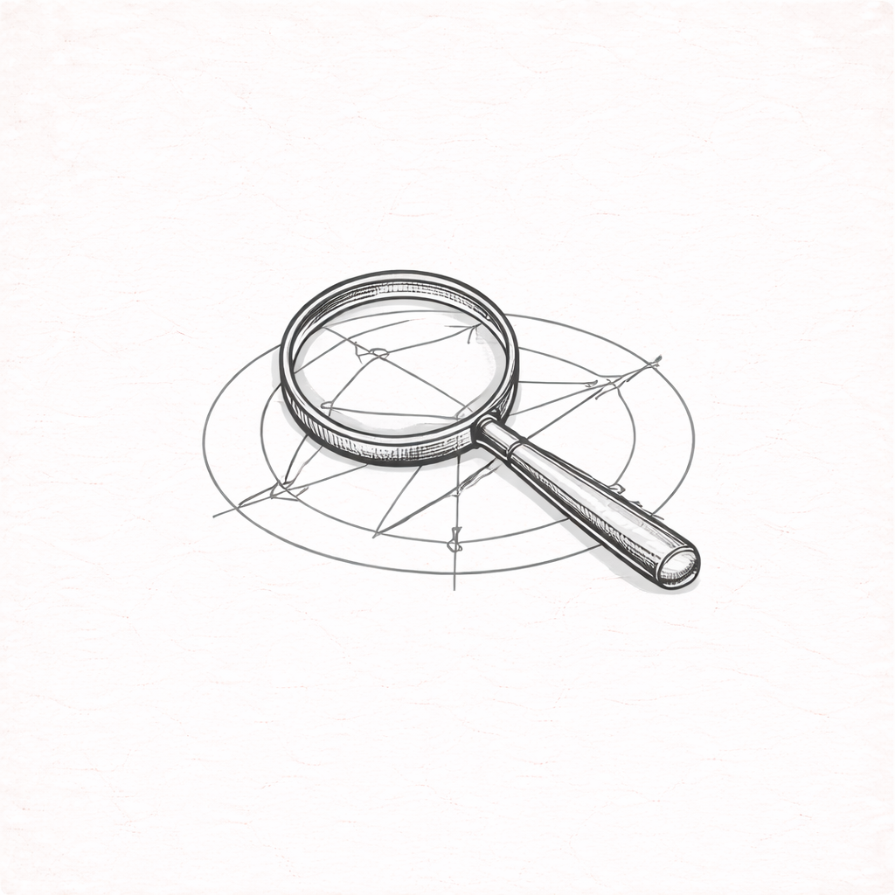

## Overview

Visual Toolkit is a project stub for a small library of tools that support image annotation, visual comparison, and diagram-first exploration.

## Context / Problem

Many workflows depend on quick visual interpretation, but the tools are often either too heavy or too fragmented. The challenge is to keep the toolkit lightweight while still making it genuinely useful.

## What I Built

The toolkit combines a handful of focused utilities for marking up images, comparing iterations, and producing rough but readable visual artifacts during project work.

## Visuals

Use this section for screenshots, diagrams, mockups, or process images.

## What I Learned

Visual tooling becomes more valuable when it reduces hesitation. The right tool is often the one that helps you inspect, compare, and decide faster without demanding much setup.

## Related Links

- Future writing can document how the toolkit supports research and design workflows.
- The demo, repo, and blog links in front matter appear automatically near the top of the page.
