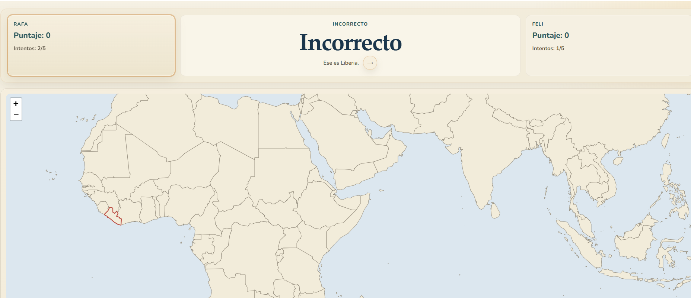

El otro fin de semana, mi hijo me hizo una pregunta: ¿cuáles son los países vecinos de India?

La convertí en [un juego](https://verdant-mochi-1d33d0.netlify.app/). Una aplicación en React, un dataset de geografía y unas horas de trabajo con Codex. Al día siguiente ya estábamos jugando.

Antes del *vibe coding*, poner en marcha este proyecto me habría llevado muchas más horas. Pero lo más interesante fue lo rápido que pude descubrir qué quería construir. Tener una primera versión me permitió probar una idea con mi hijo, ver qué nos divertía y empezar a imaginar qué podía mejorar.

El juego funciona. Jugamos y pasamos un buen rato. Pero tener un prototipo funcionando solo te hace ver todo lo que falta pensar a la hora de crear un juego que enseña.

## Más lejos del código, más cerca del mapa

Hace poco escuché a Jeremy Howard hablar de cómo el vibe coding aliena al programador del código que produce. En esa misma charla defendía el valor de los notebooks: permiten interactuar directamente con los objetos que tenemos en la memoria de la computadora.

Entiendo la preocupación. Cuando trabajo con código que escribí y conozco, puedo seguir su lógica, inspeccionar sus partes y entender por qué algo falla. Si delego buena parte de esa escritura, esa familiaridad no aparece por arte de magia.

Pero mientras hacía el juego noté algo: cuando programo, paso mucho tiempo mirando el código. Cuando programo con Codex, paso mucho tiempo mirando el producto que estoy generando.

Mi atención cambia de lugar. En vez de concentrarme en conectar herramientas y organizar componentes, miro el mapa, pruebo una interacción y pienso qué debería pasar después.

Howard mencionaba un bug particularmente difícil del kernel de IPython, un problema que muy pocas personas podrían entender en profundidad. Nada que ver con lo que yo hago en mi día a día.

En este proyecto, el código era el medio. Lo que quería explorar era un dataset de países y sus relaciones geográficas. Para esa tarea, un mapa interactivo puede ser una interfaz más útil que un notebook.

Puedo conocer menos detalles de la implementación y, al mismo tiempo, tener una forma más directa de explorar los datos que me interesan. Esa posibilidad también me entusiasma para modelos teóricos y simulaciones: construir interfaces que permitan modificar parámetros, observar resultados y jugar con una idea.

## Un juego que funciona todavía no es un juego que enseña bien

La primera dinámica que pensé era bien simple: tipo una definición por penales: la compu te dice un país, lo tenés que ubicar en el mapa. 5 chances para cada jugador, el que acierta más gana. Una vez que tuvimos el prototipo, apareció un problema diferente: la dinámica del juego no estaba diseñada para aprender países.

## La próxima iteración

Hay mucho que podría agregar al dataset: ciudades, ríos, rutas. Pero tener más datos no garantiza una experiencia más rica. Primero quiero encontrar una interacción que ayude a aprender algo concreto y recordarlo después.

Codex me permitió llegar rápido a un objeto con el que podíamos jugar. Ese prototipo hizo visible el siguiente problema: diseñar qué pasa entre una pregunta, un intento, un error y una nueva oportunidad de recordar.

La primera versión respondió a “¿podemos jugar a esto?”. Ahora quiero descubrir qué tendría que cambiar para que, unos días después, mi hijo pueda decirme cuáles son los vecinos de India.
