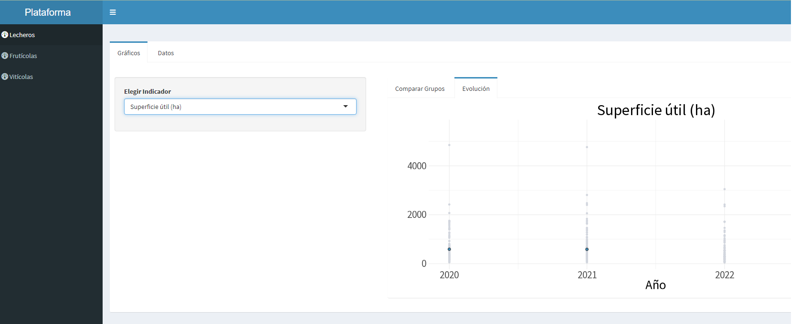
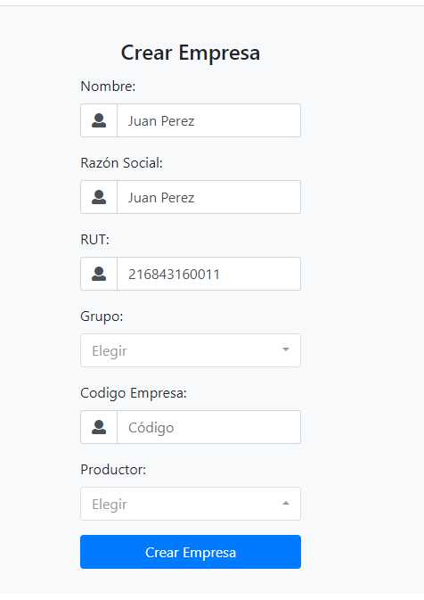
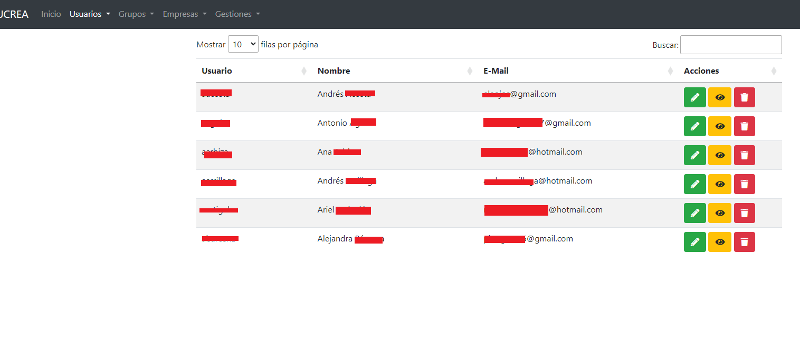
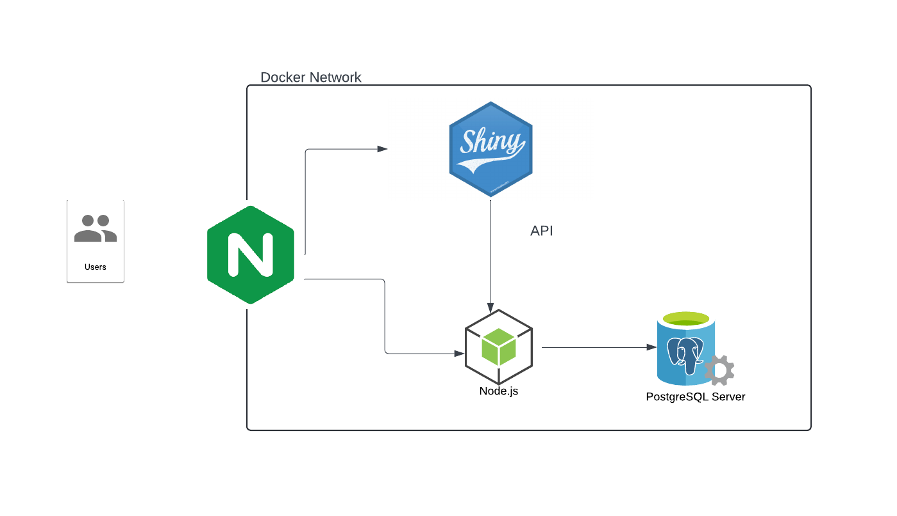

## El proyecto

FUCREA es una organizacion que nuclea a mas de 500 productores rurales de Uruguay. Estos productores se organizan en grupos, con asesores que relevan informacion productiva y economica de las empresas para apoyar la toma de decisiones.

## Contexto y problema

El objetivo del proyecto fue facilitar el uso de esos datos mediante analisis y visualizaciones que permitieran a distintos perfiles sacar conclusiones utiles a partir de la informacion disponible.

El desafio principal no era solo mostrar datos. El sistema necesitaba reflejar la logica de negocio de FUCREA para garantizar que cada usuario pudiera acceder unicamente a la informacion para la que tenia permisos. Eso implicaba multiples roles, permisos diferenciados y relaciones dinamicas entre usuarios, grupos, asesores y empresas.

## Que construimos

La solucion combina una aplicacion web de administracion, una base de datos relacional en PostgreSQL, una API para consumo de datos y multiples dashboards interactivos construidos con R y Shiny.

El staff de FUCREA administra las relaciones entre entidades desde la aplicacion web, y ese modelo de relaciones se usa luego para resolver autorizacion y acceso a los distintos tableros.

## Modelo de autorizacion

La parte mas delicada del proyecto fue disenar un mecanismo de autorizacion que siguiera la logica real de la organizacion. Los permisos no dependen solo de un rol fijo, sino tambien de las relaciones entre las entidades del sistema y de como esas relaciones cambian en el tiempo.

Eso obligo a pensar el sistema como una combinacion entre reglas de negocio, gestion operativa y seguridad de acceso, en lugar de tratar la autorizacion como una capa agregada al final.

## Dashboards

Los datos se presentan en multiples dashboards que consumen informacion de la base de datos a traves de una API. La prioridad fue que las visualizaciones fueran utiles para explorar resultados productivos y economicos sin comprometer seguridad ni privacidad.

## Visuales

## Infraestructura

El sistema esta alojado en instancias EC2 en AWS. Las imagenes Docker se publican en ECR, y AWS se usa tambien para gestionar backups de manera sencilla mediante snapshots diarios de los volumenes.

La solucion combina R y Shiny con Node y Docker para mantener separadas las responsabilidades de visualizacion, logica de aplicacion y despliegue, con foco en seguridad y privacidad de los datos.

## Aprendizajes

Este proyecto me obligo a disenar la visualizacion y la arquitectura al mismo tiempo. Cuando el acceso a los datos depende de relaciones de negocio reales, la calidad del sistema no se juega solo en la interfaz o en los dashboards, sino en que el modelo de autorizacion sea comprensible, mantenible y fiel a la organizacion.

## Enlaces relacionados

- La charla de LatinR incluida en los enlaces resume la implementacion con bastante mas detalle.
